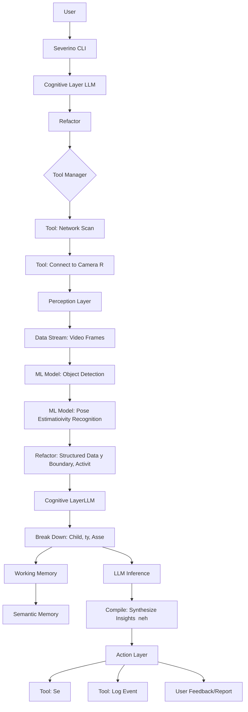

# Severino IoT Agent Architecture Diagrams

## 1. Child Safety Monitoring (Camera Example)

This diagram illustrates how Severino processes a user's natural language prompt to monitor a child's safety using a camera, applying the Refactor, Break Down, and Compile steps.

```mermaid
graph TD
    A[User Prompt: "Watch child on balcony"] --> B{Severino CLI}
    B --> C{Cognitive Layer (LLM)}
    C --> C1[Refactor: Interpret Prompt, Identify Goal (Child Safety)]
    C1 --> D{Tool Manager}
    D --> D1[Tool: Network Scan (Discover Cameras)]
    D1 --> D2[Tool: Connect to Camera (RTSP/ONVIF)]
    D2 --> E[Perception Layer (Jetson/Edge Device)]
    E --> E1[Data Stream: Video Frames]
    E1 --> E2[ML Model: Object Detection (Child, Balcony)]
    E2 --> E3[ML Model: Pose Estimation/Activity Recognition]
    E3 --> F[Refactor: Structured Data (Child Position, Balcony Boundary, Activity)]
    F --> G{Cognitive Layer (LLM)}
    G --> G1[Break Down: Decompose Goal (Track Child, Evaluate Proximity, Assess Danger)]
    G1 --> H{Working Memory}
    H --> I{Semantic Memory (Safety Rules, Balcony Geometry)}
    G1 --> J{LLM Inference (Iterative Reasoning)}
    J --> K[Compile: Synthesize Insights (e.g., "Child near edge", "High Risk")]
    K --> L{Action Layer}
    L --> L1[Tool: Send Alert (Parent's Phone)]
    L --> L2[Tool: Log Event]
    L --> M[User Feedback/Report]
```

## 2. Automated Quality Control (Factory/SMB Example)

This diagram shows Severino's application in an SMB manufacturing setting for automated quality control, demonstrating its ability to monitor, analyze, and act on production data.


