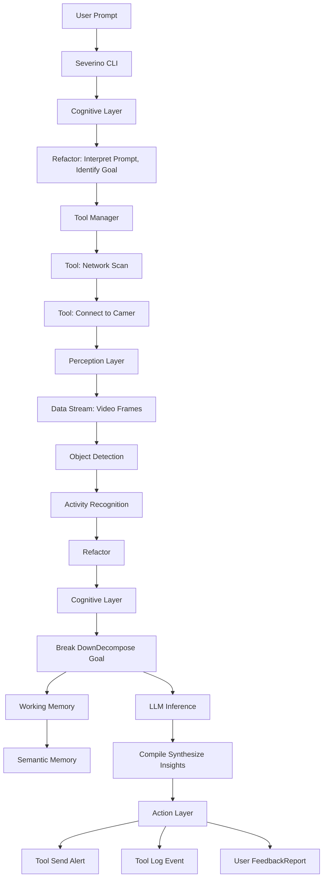
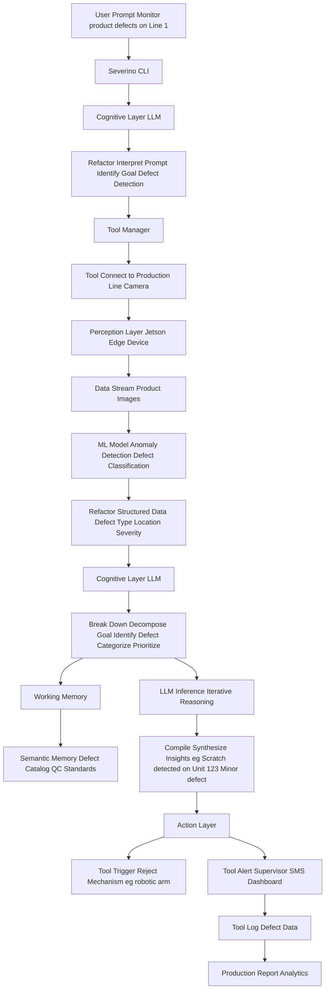

# Severino IoT Agent Architecture Diagrams

## 1. Child Safety Monitoring (Camera Example)

This diagram illustrates how Severino processes a user's natural language prompt to monitor a child's safety using a camera, applying the Refactor, Break Down, and Compile steps.

## 2. Automated Quality Control (Factory/SMB Example)

This diagram shows Severino's application in an SMB manufacturing setting for automated quality control, demonstrating its ability to monitor, analyze, and act on production data.

