Severino CLI: Your Intelligent Development Orchestrator
Severino isn't just another tool; it's a strategic necessity for organizations aiming for peak efficiency, deep insights, and scalable operations in their software and ML development. It transforms complex workflows into intelligent, streamlined processes, delivering immediate, measurable value.

What Makes Severino Indispensable?
Severino is built on a few core pillars that set it apart:

Intelligent Automation at Your Fingertips
Severino translates your natural language commands (powered by Gemma) into precise, optimized sequences of tool actions. Think of it as an intelligent conductor for your development orchestra. It anticipates your needs, minimizes manual intervention, and significantly speeds up development cycles. Its command-line interface gives you complete control and transparency, while a built-in terminal chat offers instant clarification, keeping you in your flow.

Proactive ML Monitoring and Risk Mitigation
Leveraging its Cognitive Architecture for Monitoring Agent (CAMA), Severino acts as a vigilant ML monitoring system. It takes raw data like drift reports and performance metrics, then uses Gemma to turn them into human-readable, actionable insights and recommendations. This means you can spot and address potential ML system issues before they cause costly failures, ensuring your models stay healthy and reliable.

Seamless Multimodal Interaction, No Distraction
Severino offers smart multimodal capabilities. Its severino listen command provides a minimal, non-intrusive UI for voice input, letting you rapidly execute commands and enter data hands-free. For more complex tasks, it triggers lightweight, temporary UI elements that give you the information or controls you need without pulling you away from your terminal. It's about enhancing efficiency, not creating distractions.

Lean, Mean, and Built for Performance
Designed with a "lightweight and performant" philosophy, Severino prioritizes local Gemma inference. This ensures your data stays private, latency is minimal, and you're less reliant on expensive cloud services. Its UI elements are designed to be ephemeral and consume very few system resources, guaranteeing that Severino is always responsive and never gets in the way of your critical development tasks.

How Severino Works: Features in Action
Severino is packed with features designed to deliver tangible results:

Core CLI Power
It understands and processes your natural language prompts, managing conversational context for smooth, ongoing interactions. It can execute a wide array of local and remote tools dynamically, always asking for your confirmation before running sensitive commands that could modify your system or data. Plus, its architecture is built for easy expansion, so you can integrate new tools as your needs evolve.

Smart AI Integration
Severino uses local LLMs like Gemma for enhanced data privacy and reduced cloud dependency, allowing for offline capabilities. It intelligently constructs and refines prompts for these LLMs, incorporating your conversation history and tool definitions to ensure highly accurate and relevant AI responses.

Comprehensive Tool Management
A dedicated ToolManager allows for the registration, discovery, and orchestration of various tools, making your development environment a cohesive, intelligent ecosystem. Severino's AI can intelligently select and chain multiple tools to accomplish complex goals, automating intricate workflows seamlessly.

Direct Command-Line Control
You can interact with Severino intuitively. Use severino <your_natural_language_prompt> for general tasks, or specific commands like severino read <file_path> to quickly view files, or severino shell <command> to execute shell commands (with a security prompt for risky ones). It also provides commands for managing configurations (severino config), interactive chat sessions (severino chat), history (severino history), UI elements (severino code), and diagnostics (severino self-diagnose).

Under the Hood: Architecture & Development
Severino is a robust, scalable, and modular system, primarily built in Python. Its modern architecture includes:

Backend/API: A highly performant Cloudflare Worker for global distribution and low latency.

Frontend: A dynamic React/JavaScript user interface.

Database: PostgreSQL for reliable data storage.

Message Queue: Apache Kafka for real-time data streaming and asynchronous communication.

CI/CD: GitHub Actions for automated testing and rapid, reliable deployments.

Designed for Excellence (DDD & TDD)
Severino's development adheres to rigorous practices:

Domain-Driven Design (DDD): This ensures the software design directly reflects the business domain. It establishes a clear "Ubiquitous Language" (e.g., Agent, Directive, Insight), defines distinct "Bounded Contexts" (like Agent Core, Perception, ML Inference), and identifies "Aggregates" to maintain data consistency. This approach results in a highly maintainable and scalable architecture.

Test-Driven Development (TDD): Following a "Red-Green-Refactor" cycle, tests are written before code. This includes extensive unit and integration tests for all core components (memory, tool manager, LLM, perception, ML models, actions) and end-to-end acceptance tests for real-world scenarios (e.g., child safety monitoring). TDD guarantees a robust, well-tested codebase, reducing bugs and providing a safety net for continuous development.

License
Please remember that Severino operates under a Custom Non-Commercial License. This means it's free for non-commercial use, but commercial use is strictly reserved for the original Creator.

The Future of Severino
We're continuously enhancing Severino. Our roadmap includes:

Expanded Multimodality: Going beyond text to process images, audio, and structured data.

Advanced Reasoning: Integrating more sophisticated modules for complex problem-solving.

Industry Specialization: Developing tailored modules and knowledge bases for specific sectors.

User-Centric Automation: Enabling automated task execution based on analyzed data.

Severino is more than just a tool; it's your strategic partner for AI-driven success, transforming data into a decisive advantage.

# Severino IoT Agent Architecture Diagrams

```mermaid
---
config:
  layout: fixed
  theme: base
  themeVariables:
    primaryColor: '#ffffff'
    primaryTextColor: '#1f2937'
    primaryBorderColor: '#3b82f6'
    lineColor: '#6b7280'
    secondaryColor: '#10b981'
    tertiaryColor: '#f59e0b'
    background: '#ffffff'
    mainBkg: '#f8fafc'
    secondBkg: '#e2e8f0'
    clusterBkg: '#f1f5f9'
---

flowchart TD
    User[👤 User] --> CLI[🖥️ Severino CLI]
    CLI -.->|Local IPC| ReactUI[⚛️ Electron UI Hub]
    
    subgraph Severino["🚀 Severino MLOps Platform"]
        direction TB
        
        subgraph InterfaceLayer["🌐 API Gateway"]
            API_CLI_Interface[📡 RESTful API Gateway<br/>gRPC & WebSocket<br/>Auth & Rate Limiting]
        end
        
        subgraph CoreLayer["🧠 Agent Orchestration"]
            Agent_Orchestration[🎯 Multi-Agent Coordinator<br/>Task Scheduling<br/>Resource Management]
        end
        
        subgraph IntelligenceLayer["🤖 AI/ML Processing"]
            LLM_Inference[💭 LLM Inference Engine<br/>Model Caching<br/>Batch Processing]
            ML_Model_Module[🔬 ML Model Pipeline<br/>Training & Validation<br/>Model Registry]
            Perception_Module[👁️ Computer Vision<br/>Image Processing<br/>Object Detection]
        end
        
        subgraph LLMServices["🧮 LLM Infrastructure"]
            LLM_Selection_Config[⚙️ LLM Router<br/>Load Balancing<br/>Failover Logic]
            LocalLLM[🏠 Local LLM<br/>GGML Support<br/>GPU Acceleration]
            CloudLLM[☁️ Cloud APIs<br/>OpenAI/Anthropic<br/>Connection Pooling]
        end
        
        subgraph DataLayer["💾 Data Platform"]
            Data_Persistence[📊 Data Persistence<br/>CRUD Operations<br/>Backup & Recovery]
            SQLite[🗄️ SQLite Database<br/>WAL Mode<br/>Optimized Indexes]
            MLMonitoring[📈 ML Monitoring<br/>Performance Tracking<br/>Drift Detection]
        end
        
        subgraph EdgeLayer["🌐 Edge Computing"]
            Device_Sensor_Data[📡 Device Streams<br/>Protocol Adapters<br/>Stream Processing]
            Edge_Device[🔌 Edge AI Devices<br/>Jetson/RPi Support<br/>Container Deployment]
        end
    end
    
    %% Core Connections
    ReactUI -.->|HTTP/WebSocket| API_CLI_Interface
    CLI -.->|gRPC| API_CLI_Interface
    
    API_CLI_Interface ==> Agent_Orchestration
    Agent_Orchestration ==> LLM_Inference
    Agent_Orchestration ==> ML_Model_Module
    Agent_Orchestration ==> Perception_Module
    Agent_Orchestration ==> Data_Persistence
    
    %% LLM Flow
    LLM_Inference <--> LLM_Selection_Config
    LLM_Selection_Config --> LocalLLM
    LLM_Selection_Config --> CloudLLM
    LocalLLM --> LLM_Inference
    CloudLLM --> LLM_Inference
    
    %% Data Flow
    ML_Model_Module <--> MLMonitoring
    Data_Persistence <--> SQLite
    
    %% Edge Flow
    Perception_Module <--> Device_Sensor_Data
    Device_Sensor_Data <--> Edge_Device
    API_CLI_Interface --> Edge_Device
    Edge_Device --> Perception_Module
    
    %% Value Props
    Agent_Orchestration -.->|"Reduces complexity"| IntelligenceLayer
    LLM_Selection_Config -.->|"Cost optimization"| LLMServices
    MLMonitoring -.->|"Production reliability"| DataLayer
    
    %% Styling
    classDef userClass fill:#10b981,stroke:#059669,stroke-width:3px,color:#ffffff
    classDef cliClass fill:#3b82f6,stroke:#2563eb,stroke-width:2px,color:#ffffff
    classDef interfaceClass fill:#6366f1,stroke:#4f46e5,stroke-width:2px,color:#ffffff
    classDef coreClass fill:#f59e0b,stroke:#d97706,stroke-width:3px,color:#ffffff
    classDef intelligenceClass fill:#ec4899,stroke:#db2777,stroke-width:2px,color:#ffffff
    classDef llmClass fill:#8b5cf6,stroke:#7c3aed,stroke-width:2px,color:#ffffff
    classDef dataClass fill:#06b6d4,stroke:#0891b2,stroke-width:2px,color:#ffffff
    classDef edgeClass fill:#ef4444,stroke:#dc2626,stroke-width:2px,color:#ffffff
    
    class User userClass
    class CLI,ReactUI cliClass
    class API_CLI_Interface interfaceClass
    class Agent_Orchestration coreClass
    class LLM_Inference,ML_Model_Module,Perception_Module intelligenceClass
    class LLM_Selection_Config,LocalLLM,CloudLLM llmClass
    class Data_Persistence,SQLite,MLMonitoring dataClass
    class Device_Sensor_Data,Edge_Device edgeClass
```

